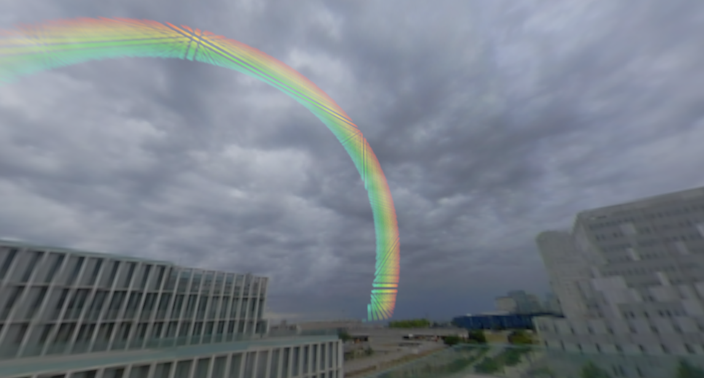

# Unity3DRainbowECS
Simple study of Unity3D ECS.

This is a basic example of Unity's Data-Oriented Technology Stack (DOTS). It consists of a cube containing an array of 60x60x60 water droplets. Depending on the light source direction and the camera position, each droplet will scatter a color to the camera. The combined contribution of all these droplets appears to the observer as a rainbow.

Testing: 20 fps (216000 instances) on a I7-4770 @3.40 Geforce1080 Gtx

Unity Version: 2020.3.4f1

